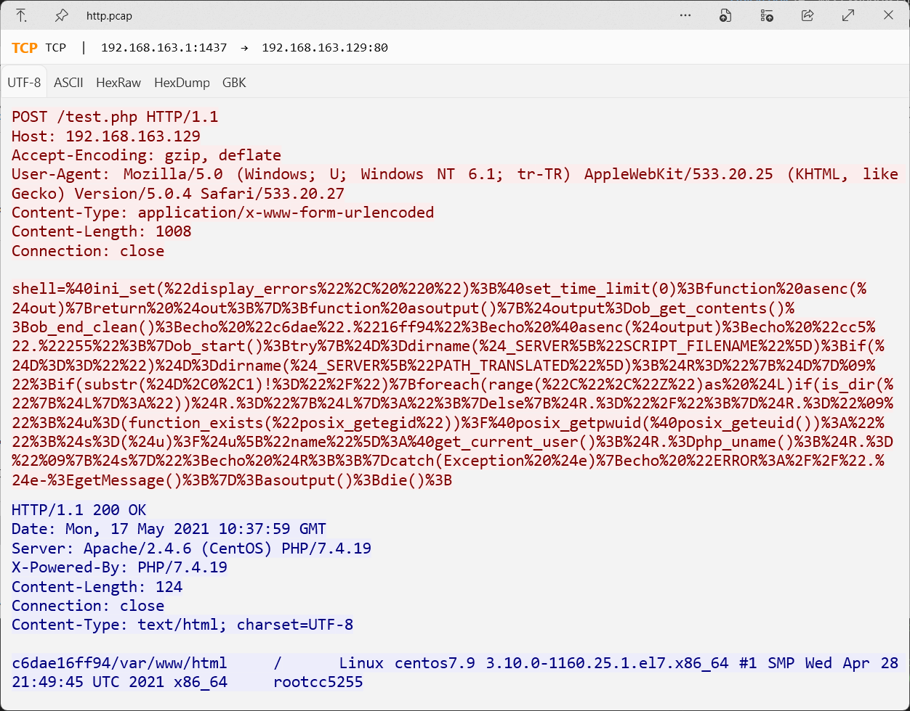
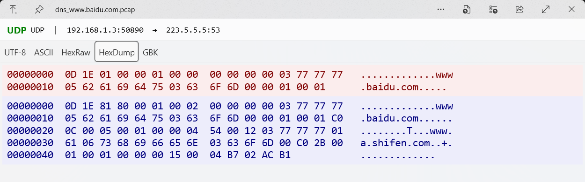

# QuickLook Plugin - PcapViewer

[](https://www.gnu.org/licenses/gpl-3.0)
[](https://github.com/QL-Win/QuickLook)

**QuickLook 的 pcap 文件预览插件** — 支持在 QuickLook 中直接预览网络抓包文件。

---

## 简介

[QuickLook](https://github.com/QL-Win/QuickLook) 是一款为 Windows 带来 macOS 风格「快速预览」体验的开源工具。本插件为其添加了对 `.pcap` 文件的预览支持，可以像预览文档一样快速查看网络抓包数据，无需等待启动 Wireshark 等工具。

## 功能特性

- **快速预览** — 在资源管理器中选中 `.pcap` 文件，按下空格键即可预览
- **多协议支持** — 解析 TCP、UDP、ICMP 协议的网络流量
- **IPv4/IPv6 双栈** — 完整支持 IPv4 和 IPv6 流量
- **封装协议** — 自动解析 VLAN (802.1Q)、VXLAN、GRE 隧道（支持 IPv6 over IPv4 等组合模式）
- **ICMPv6** — 支持 ICMPv6 协议
- **应用层协议识别** — 自动识别 HTTP、DNS、TLS 等应用层协议并显示在信息栏
- **多种编码视图** — 支持 UTF-8、ASCII、HexRaw、HexDump、GBK 等编码显示
- **请求/响应区分** — 以类似 Wireshark 的经典红蓝色区分客户端请求和服务端响应
- **信息栏显示** — 顶部显示协议类型（含 IPv6/VXLAN/应用层协议标识）、源地址 → 目的地址

## 截图

### 预览 TCP 流量


### 预览 UDP 流量 & 切换编码视图


## 使用

1. 从 [Releases](https://github.com/qlcncn/QuickLook.Plugin.PcapViewer/releases) 页面下载最新的插件包
2. 将插件压缩包复制到 QuickLook 安装路径下的插件目录 `<QuickLook_Dir>\Plugins\` 解压
3. 重启 QuickLook 即可生效

### 手动构建

```bash
# 克隆仓库
git clone https://github.com/wdcwhfc/QuickLook.Plugin.PcapViewer.git

# 构建
cd QuickLook.Plugin.PcapViewer
dotnet build -c Release

# 构建产物位于
# Build\Release\QuickLook.Plugin\QuickLook.Plugin.PcapViewer\

# 把 QuickLook.Plugin.PcapViewer 目录直接拷贝到 QuickLook 安装路径下的插件目录 <QuickLook_Dir>\Plugins\
```

## 测试

```bash
dotnet test
```

基于 `test_pcaps/` 目录下的样本文件运行 123 个单元测试，覆盖 PcapReader、PcapPacketParser、SessionIdentifier、TcpStreamReassembler、HttpParser、HexConverters 等核心模块。

## 限制说明

- 仅支持经典 pcap 格式（magic `0xa1b2c3d4` / `0xa1b23c4d`），不支持 pcapng 格式
- 仅支持 **Ethernet** 链路层类型
- 仅支持单会话（**TCP** 是第一个有三次握手的会话，**UDP/ICMP** 是第一对 IP 对）
- Payload 数据上限为 **1 MB**，超过部分将被截断并显示 `[TRUNCATED > 1MB]` 标记

## TODO

- DNS、TLS 重要字段提取展示

## 依赖

- [QuickLook.Common](https://www.nuget.org/packages/QuickLook.Common/) v4.5.0
- [PacketDotNet](https://www.nuget.org/packages/PacketDotNet/) v1.4.7

## 原始项目

本插件基于 [QuickLook](https://github.com/QL-Win/QuickLook) 开发，感谢原项目作者。

## 许可证

本项目采用 [GNU General Public License v3.0](LICENSE) 许可证。

## 相关链接

- [QuickLook 主项目](https://github.com/QL-Win/QuickLook)
- [QuickLook 插件列表](https://github.com/QL-Win/QuickLook/wiki/Plugins)
